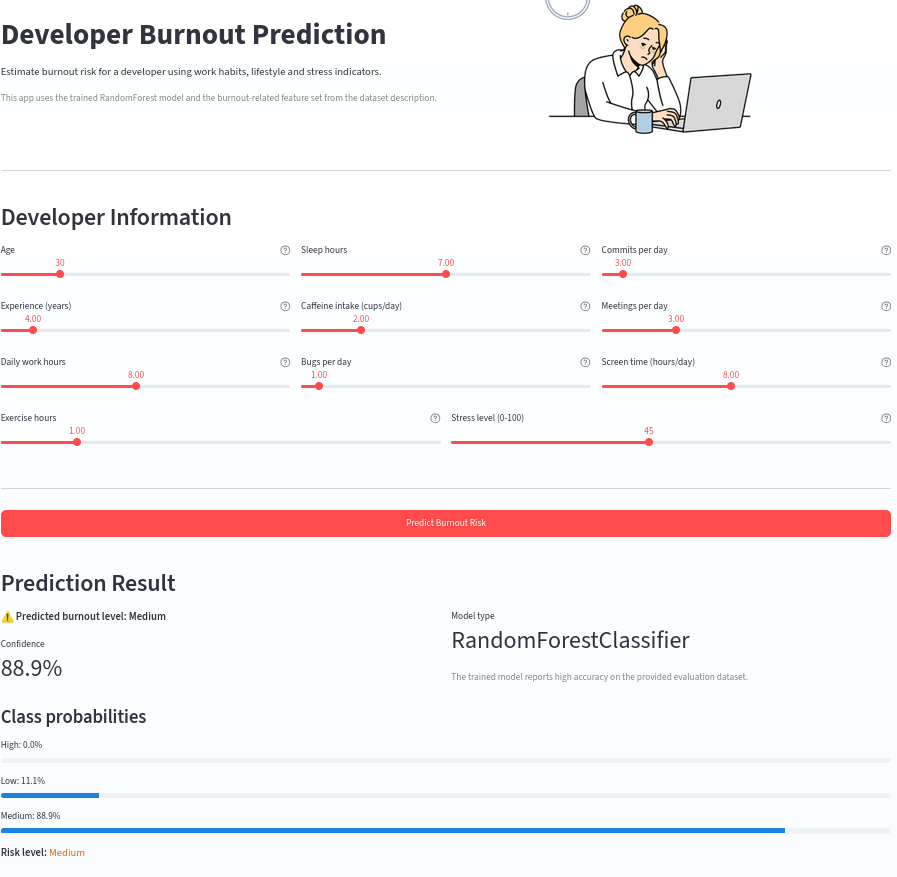
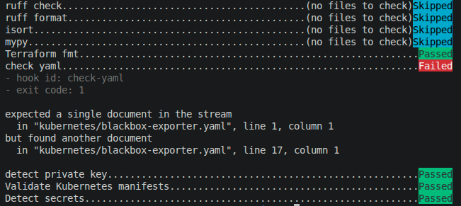
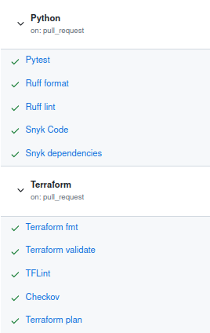
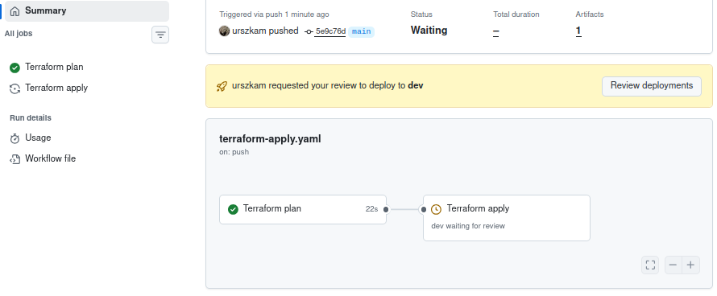
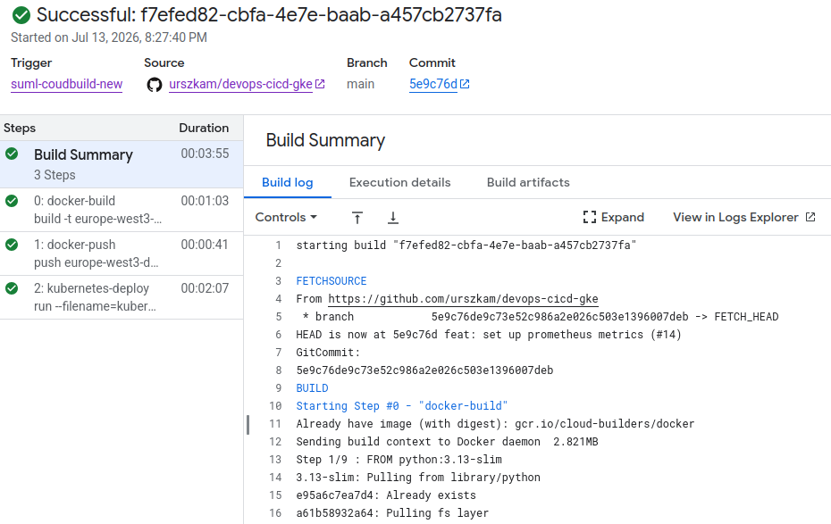

# DevOps CI/CD on Google Kubernetes Engine

## Project overview

This project demonstrates an end-to-end DevOps workflow for building and deploying a Streamlit application to Google Kubernetes Engine (GKE). The application was developed to predict developer burnout based on work habits, lifestyle and stress-related data.

The Google Cloud infrastructure is managed with modular Terraform and includes a custom VPC, a GKE Autopilot cluster, dedicated service accounts and an Artifact Registry repository. Terraform uses a remote state stored in Cloud Storage.

Pull requests trigger automated application, Kubernetes and Terraform validation in GitHub Actions. Infrastructure changes use Workload Identity Federation to authenticate to Google Cloud, publish a Terraform plan in GitHub and require user approval before `terraform apply`. After application changes are merged into the main branch, Cloud Build builds the Docker image, pushes it to Artifact Registry and deploys the Kubernetes manifests to GKE.

Observability is provided by Google Cloud Monitoring and Cloud Logging. Google Cloud Managed Service for Prometheus collects application availability and response-time metrics exposed through Blackbox Exporter.

## Streamlit Application

The application is a Streamlit app that lets users enter developer profile values and receive a burnout prediction with class probabilities.



### Data

The dataset contains developer-related features such as age, experience, daily work hours, sleep, caffeine intake, bugs and commits per day, meetings, screen time, exercise, stress level and burnout level. It is used for burnout classification.

Dataset source: https://www.kaggle.com/datasets/asifxzaman/developer-burnout-prediction-dataset7000-samples/data

### Model

The trained model is a RandomForestClassifier. The recorded evaluation results are 0.9920 accuracy, 0.9919 macro F1 and 0.9920 weighted F1.


## Git hooks

The project uses the `pre-commit` framework to run local checks before changes are committed or pushed. This provides fast feedback and prevents common formatting, quality, security and configuration errors from reaching the remote repository.

- **Ruff, isort and mypy** check Python formatting, imports, linting and types.
- **terraform fmt** applies the canonical formatting to Terraform files.
- **check-yaml and kubeconform** validate YAML files and Kubernetes manifests.
- **detect-private-key and detect-secrets** help prevent credentials and other sensitive values from being committed.
- **Conventional Commits** validates commit message formatting through the `commit-msg` hook.



## CI/CD

The project uses separate pipelines for pull request validation, infrastructure deployment and application delivery. Path filters ensure that each pipeline runs only when files relevant to it are changed.

### Pull request validation

GitHub Actions validates changes before they are merged:

- **App** runs Pytest, Ruff formatting and linting, Snyk security scans and a Docker image build.
- **Kubernetes** validates manifests with kubeconform.
- **Terraform** runs formatting, validation, TFLint and Checkov, and publishes a Terraform plan in the GitHub Actions summary.



### Infrastructure pipeline

Infrastructure changes merged into `main` trigger the Terraform workflow in GitHub Actions. The workflow authenticates to Google Cloud through Workload Identity Federation, creates a saved Terraform plan and uploads it as a short-lived artifact. The apply job uses the protected `dev` environment and waits for user approval before applying the exact saved plan.



### Application pipeline

Application and Kubernetes changes merged into `main` trigger Cloud Build. The pipeline:

1. builds the application Docker image tagged with the commit SHA,
2. pushes the image to Artifact Registry,
3. resolves the immutable image digest,
4. deploys the Kubernetes manifests to GKE.



## Cloud

The application is deployed to Google Kubernetes Engine. Docker images are stored in Artifact Registry.

### Prerequisites

- A Cloud Build trigger runs `cloudbuild.yaml` with a service account that can manage Terraform state, service accounts, Artifact Registry and GKE.
- The Terraform state bucket `suml-s28722-terraform-state` exists.

## Terraform

Terraform provisions and manages the Google Cloud infrastructure required by the application. The configuration is divided into reusable modules with clearly separated responsibilities.

| Module | Responsibility |
| --- | --- |
| `project_services` | Enables the required Google Cloud APIs. |
| `artifact_registry` | Creates the Docker repository used for application images. |
| `vpc` | Creates the custom VPC, subnet, secondary Pod range, firewall rule, router and Cloud NAT. |
| `iam` | Creates the dedicated GKE node service account and assigns its minimal roles. |
| `gke` | Creates the private-node GKE Autopilot cluster using the stable release channel. |

The cluster uses the custom VPC and service account instead of their default equivalents. The configuration also enables features such as Workload Identity, Shielded GKE Nodes, the GKE Metadata Server, Binary Authorization and master authorized networks.

### State and environment configuration

Terraform state is stored remotely in the `suml-s28722-terraform-state` Cloud Storage bucket under the `dev` prefix. The GCS backend provides shared state and state locking for local and CI operations.

Environment-specific values are defined in `terraform/tfvars/dev.tfvars`, while common labels are generated in `terraform/locals.tf`. Terraform and Google provider version constraints are defined in `terraform/versions.tf`.

The state bucket, GitHub Workload Identity Federation provider and GitHub Actions service account are bootstrap resources created outside this Terraform configuration.

### Initial bootstrap

Artifact Registry is not created by the application pipeline. During the initial setup, the Terraform infrastructure workflow must be completed first. After user approval, `terraform apply` enables the required APIs and creates Artifact Registry, the network, IAM resources and the GKE cluster. Cloud Build can then build and push the first application image to the existing repository and deploy it to GKE.

This ordering keeps infrastructure provisioning out of the application pipeline and avoids a circular dependency on an Artifact Registry repository that does not yet exist.

### Validation and deployment

Terraform changes are validated on pull requests with `terraform fmt`, `terraform validate`, TFLint and Checkov. GitHub Actions then authenticates to Google Cloud through Workload Identity Federation and publishes the Terraform plan in the workflow summary.

After changes are merged into `main`, the infrastructure workflow creates and stores a new plan. The protected `dev` environment pauses the apply job until a user approves it. The exact saved plan is then applied, preventing differences between the reviewed plan and the deployed infrastructure.

For local validation and planning:

```sh
cd terraform
gcloud auth application-default login
terraform init -reconfigure
terraform fmt -check -recursive
terraform validate
terraform plan -var-file=tfvars/dev.tfvars
```

## Kubernetes

The application runs on a regional GKE Autopilot cluster. Kubernetes manifests are stored in the `kubernetes` directory and are validated with kubeconform on pull requests before Cloud Build deploys them with `gke-deploy`.

### Application workload

The `burnout-app-deployment` Deployment runs two replicas of the Streamlit container on port `8080`. Explicit CPU and memory requests and limits provide predictable resource allocation in Autopilot.

The Deployment includes two HTTP health checks using the Streamlit `/_stcore/health` endpoint:

- **readiness probe** prevents a Pod from receiving traffic until the application is ready,
- **liveness probe** restarts the container when the application stops responding.

The manifest contains the Artifact Registry image name with a placeholder tag. During deployment, `gke-deploy` replaces it with the immutable digest of the image built for the current commit. Kubernetes then performs a rolling update of the application replicas.

### Application service

The `burnout-app-service` Service uses the `LoadBalancer` type. It exposes the application externally on port `80` and forwards traffic to port `8080` on ready application Pods.

### Prometheus monitoring resources

The Blackbox Exporter configuration, Deployment and `PodMonitoring` resource are defined in `kubernetes/blackbox-exporter.yaml`. The exporter checks the internal Streamlit health endpoint every 30 seconds and exposes availability, HTTP status and response-time metrics. Google Cloud Managed Service for Prometheus collects these metrics and stores them in Cloud Monitoring.

## Local setup

Python 3.13 is used in the Docker image and CI workflows.

1. Clone the repository:
   ```sh
   git clone https://github.com/urszkam/devops-cicd-gke.git
   cd projekt
   ```
2. From the project root, install development dependencies and Git hooks:
   ```sh
   python -m pip install -r requirements.txt
   pre-commit install
   pre-commit install --hook-type pre-push
   pre-commit install --hook-type commit-msg
   ```
3. Build and run the Docker image:
   ```sh
   docker build -t burnout-app app
   docker run --rm -p 8080:8080 burnout-app
   ```

To run the app without Docker, install the app dependencies and start Streamlit:

```sh
python -m pip install -r app/requirements.txt
cd app
streamlit run app.py --server.port=8080
```
